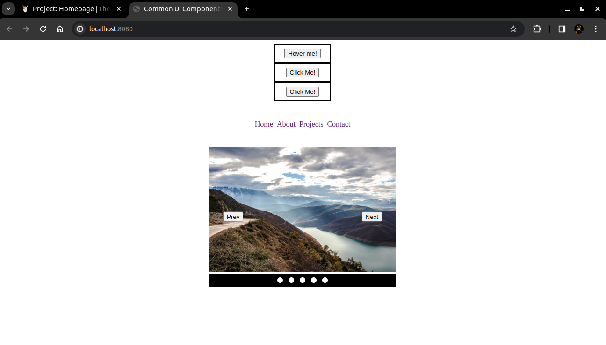

# A Project About Common UI Interfaces

This was created as a project as a way to learn about components common to developers [in this lesson](https://www.theodinproject.com/lessons/node-path-javascript-dynamic-user-interface-interactions) on Odin Project.

## Table of Contents

- [Demo](#demo)
- [Screenshot](#screenshot)
- [Build With](#built-with)
- [Contributing](#contributing)
- [License](#license)
- [Acknowledgments](#acknowledgments)

## Demo

You can demo it live at [Demo](https://tonyfred-code.github.io/common-ui-components/)

## Screenshot

## Built With

- JS
- HTML5
- CSS3

## Contributing

Contributions are welcome! If you'd like to contribute to this project, please follow these guidelines:

1. Fork the repository.
2. Create a new branch for your feature or bug fix.
3. Make your changes and commit them.
4. Push your changes to your fork.
5. Create a pull request.

## License

This project is licensed under the [MIT LICENSE](./LICENSE)

## Acknowledgments

Great thanks to w3schools for their content
